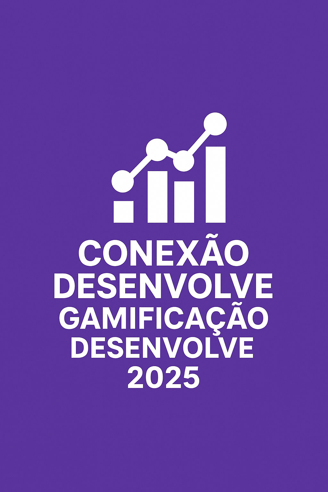

# Economia Prateada no Brasil

  

## Desafio

**O Impacto do Envelhecimento Populacional no Brasil (Censo 2022)**

Este projeto foi desenvolvido como resposta ao desafio que propõe uma análise profunda da transição demográfica acelerada no país. Com base nos dados do Censo Demográfico 2022, o Brasil enfrenta dois fenômenos interligados:

- **Envelhecimento Populacional**: aumento expressivo da população com 60 anos ou mais, pressionando os sistemas de saúde, assistência social e infraestrutura urbana.  
- **Mudança na Estrutura Domiciliar**: crescimento de domicílios unipessoais e casais sem filhos, exigindo novos formatos de moradia, serviços e políticas públicas.

---

## Objetivo do Dashboard

Construir uma ferramenta interativa que permita identificar municípios com alto potencial de mercado e urgência social relacionados à Economia Prateada — o conjunto de produtos e serviços voltados à população com 60 anos ou mais.

O dashboard cruza indicadores estratégicos para revelar onde o envelhecimento populacional está mais avançado, onde há maior poder de consumo entre os idosos, e onde a estrutura familiar aponta para novas demandas sociais.

---

## Indicadores Utilizados

- Índice de Envelhecimento  
- Proporção de casais sem filhos  
- Renda média da população com 60 anos ou mais  

---

## Público-Alvo

- **Gestores Públicos**: para planejamento de saúde, assistência social e infraestrutura urbana  
- **Investidores e Empreendedores**: para identificar hotspots de investimento em serviços voltados à longevidade  

---

## Insights Esperados

- Identificação de municípios com alto Índice de Envelhecimento e estrutura domiciliar favorável  
- Oportunidades emergentes no Norte e Nordeste com crescimento acelerado da população 60+  
- Cruzamento entre renda média e perfil domiciliar para revelar potenciais de consumo  

---

## Ferramentas e Bibliotecas Utilizadas

- Python 3.13  
- Streamlit  
- Pandas  
- Plotly Express  
- Geopy  
- Fonte de dados: SIDRA IBGE – Censo Demográfico 2022  

---

## Acesse o Dashboard

[https://mariacfagundes-economia-prateada--app-4skikj.streamlit.app/](https://mariacfagundes-economia-prateada--app-4skikj.streamlit.app/)

---

## Autoria

**Maria Clara Fagundes – Salvador, BA**  
Conexão Desenvolve – Gamificação • 2025

